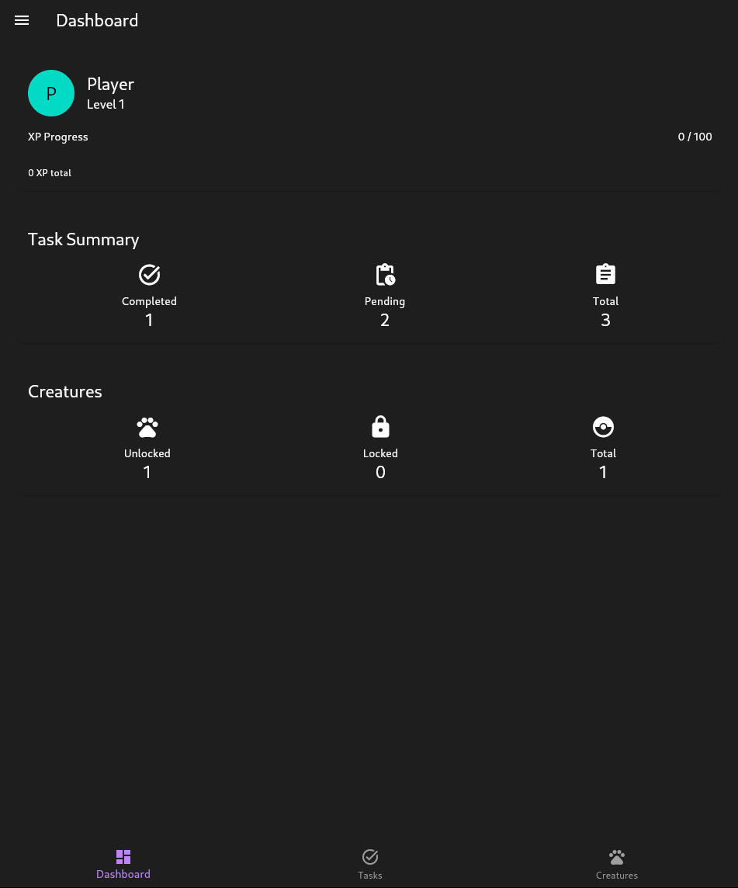

# TaskTamer

TaskTamer is a cross-platform mobile app combining task management with collectible pixel-monsters. Completing real-world tasks feeds, trains, and evolves pixel pets, turning self-organization into a fun, rewarding game.

[](https://flutter.dev)
[](https://dart.dev)
[](https://opensource.org/licenses/MIT)
[](CONTRIBUTING.md)
[](https://github.com/yourusername/TaskTamer/actions)
[](https://codecov.io/gh/yourusername/TaskTamer)
[](https://github.com/yourusername/TaskTamer/issues)
[](https://github.com/yourusername/TaskTamer/commits/main)



## Features

- **Task Management**: Create, track, and complete daily tasks and recurring habits
- **Virtual Pets**: Collect and evolve pixel creatures by completing tasks
- **Gamification**: Earn experience points, level up, and unlock new creatures
- **Notifications**: Get reminders for upcoming tasks
- **Cross-Platform**: Works on Android, iOS, and desktop platforms

## Getting Started

This project uses Flutter with the Flame engine for 2D game development.

### Prerequisites

- Flutter SDK (3.8.0+)
- Dart SDK (3.8.0+)
- For Linux: GTK development libraries
- For Chrome: A recent Chrome browser

### Installation

1. Clone the repository:

```bash
git clone https://github.com/yourusername/TaskTamer.git
cd TaskTamer
```

2. Install dependencies:

```bash
flutter pub get
```

3. Run the app:

```bash
flutter run
```

### Running the App

#### Using VS Code

Two launch configurations are available:

1. **TaskTamer (Linux)** - Runs the app as a native Linux application
2. **TaskTamer (Chrome)** - Runs the app in Chrome browser

To launch:

1. Open the project in VS Code
2. Press F5 or go to Run > Start Debugging
3. Select the desired configuration from the dropdown

#### Using Command Line

For Linux:

```bash
flutter run -d linux
```

For Chrome:

```bash
flutter run -d chrome --web-renderer html
```

## Architecture

TaskTamer follows a Clean Architecture approach with MVVM principles, using the BLoC pattern for state management. The application is organized into several layers:

```
lib/
├── main.dart
├── src/
│   ├── app.dart
│   ├── blocs/           # Business Logic Components
│   ├── models/          # Data models
│   ├── repositories/    # Data access layer
│   ├── services/        # System services
│   ├── ui/              # UI components
│   └── game/            # Flame game components
```

For more detailed information, see the [Architecture Overview](docs/architecture/overview.md).

## Development

The project follows MVVM/BLoC architecture with a clean folder structure. Key technologies include:

- **State Management:** `flutter_bloc`
- **Dependency Injection:** `get_it`
- **Local Storage:** Hive
- **Notifications:** `flutter_local_notifications`
- **Game Engine:** Flame

### Setting Up Development Environment

Run the setup script to configure git hooks and project dependencies:

```bash
dart tool/setup.dart
```

This will install pre-commit hooks that:

- Format your code automatically
- Run the analyzer to check for issues
- Run tests to ensure nothing breaks

For more information, see the [Development Workflow Guide](docs/guides/development_workflow.md).

### Running with Docker

The project includes Docker configurations for both Linux and Web platforms. You can use Docker to build and run the application without installing Flutter or dependencies locally. Our Docker setup uses the official [Cirrus Labs Flutter Docker image](https://github.com/cirruslabs/docker-images-flutter/pkgs/container/flutter) with the stable channel.

#### Prerequisites

- Docker
- Docker Compose
- X11 server (for Linux version)

#### Using the Run Script

A convenience script is provided to easily build and run the application in Docker:

```bash
# Make the script executable (first time only)
chmod +x run-docker.sh

# Show available commands
./run-docker.sh --help

# Run the web version
./run-docker.sh web

# Run the Linux version
./run-docker.sh linux

# Run both versions
./run-docker.sh all

# Stop all containers
./run-docker.sh stop

# Clean up Docker resources
./run-docker.sh clean
```

#### Manual Docker Commands

You can also use Docker Compose directly:

```bash
# Build and run the web version
docker compose up --build -d tasktamer-web

# Build and run the Linux version
xhost +local:docker  # Allow Docker containers to use X11
docker compose up --build -d tasktamer-linux

# Stop all containers
docker compose down
```

The web version will be available at <http://localhost:8080>.

### Code Quality and Standards

The project uses:

- `dart format` with a line length of 100 characters
- `dart analyze` with fatal info level set
- Flutter tests for all functionality

Git hooks ensure these checks run before commits and pushes:

- **pre-commit**: Formats code, runs analysis and tests but allows commits even if analysis or tests fail
- **pre-push**: Enforces that all formatting, analysis, and tests pass before pushing

## Testing

TaskTamer has a comprehensive test suite:

- **Unit Tests**: For models, BLoCs, repositories, and services
- **Widget Tests**: For UI components
- **Integration Tests**: For end-to-end functionality

To run tests:

```bash
flutter test
```

For more information, see the [Testing Guide](docs/guides/testing.md).

## CI/CD Pipeline

The project uses GitHub Actions for continuous integration and delivery:

- **On Pull Requests:** Code is formatted, analyzed, and tested
- **On Main Branch:** The app is built and an APK is generated

The pipeline workflow can be found in `.github/workflows/flutter_ci.yml`.

## Build

To build release versions:

```bash
# For Linux
flutter build linux --release

# For Web
flutter build web --release
```

Alternatively, use the VS Code tasks:

- `Flutter: Build Linux`
- `Flutter: Build Web`
- `Flutter: Build All`

## Documentation

Comprehensive documentation is available in the `docs` directory:

- [Architecture Overview](docs/architecture/overview.md)
- [Models Documentation](docs/models/overview.md)
- [Repositories Documentation](docs/repositories/overview.md)
- [BLoC Documentation](docs/blocs/overview.md)
- [UI Documentation](docs/ui/overview.md)
- [Game Engine Documentation](docs/game/overview.md)
- [Testing Guide](docs/guides/testing.md)
- [Development Workflow](docs/guides/development_workflow.md)

## Contributing

Contributions are welcome! Please read the [Contributing Guide](CONTRIBUTING.md) for details on how to submit pull requests.

## License

This project is licensed under the MIT License - see the [LICENSE](LICENSE) file for details.

## Acknowledgments

- [Flutter](https://flutter.dev/)
- [Flame Engine](https://flame-engine.org/)
- [Hive](https://docs.hivedb.dev/)
- [flutter_bloc](https://bloclibrary.dev/)
