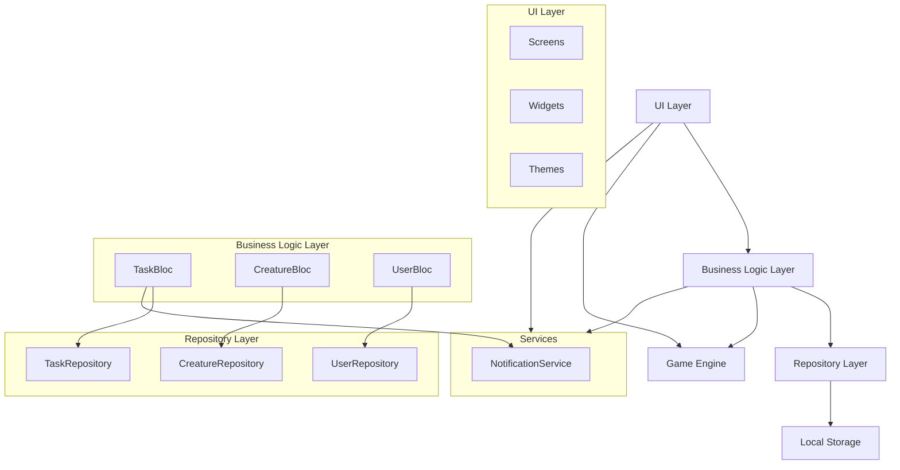
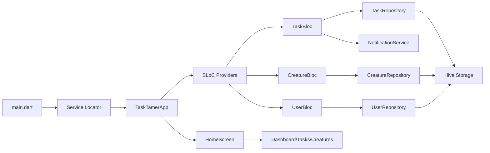

# TaskTamer Architecture Overview

TaskTamer follows a Clean Architecture approach with MVVM principles, using the BLoC pattern for state management. This document provides a high-level overview of the application architecture.

## Core Architecture Principles

1. **Separation of Concerns**: Clear boundaries between UI, business logic, and data layers
2. **Dependency Inversion**: High-level modules do not depend on low-level modules; both depend on abstractions
3. **Testability**: All components are designed to be easily testable
4. **Single Responsibility**: Each class has a single responsibility
5. **Dependency Injection**: Services and repositories are provided via dependency injection

## Architecture Layers

### Presentation Layer (UI)

- **Screens**: Main UI containers representing full application screens
- **Widgets**: Reusable UI components
- **Themes**: Visual appearance configuration

### Business Logic Layer (BLoCs)

- **TaskBloc**: Manages task state and operations
- **CreatureBloc**: Handles creature state and evolutions
- **UserBloc**: Manages user profile and settings

### Data Layer

- **Repositories**: Interface to data sources
- **Models**: Data structures representing application entities
- **Services**: System interactions (notifications, etc.)

### Game Engine

- **Flame Components**: Visual game objects
- **Game Loop**: Animation and update logic

## Component Diagram



## Dependency Flow



## Service Locator

The application uses `get_it` for dependency injection. All services, repositories, and BLoCs are registered in the service locator and can be accessed from anywhere in the application.

```dart
// Example of service locator setup
final GetIt serviceLocator = GetIt.instance;

Future<void> setupServiceLocator() async {
  // Register services
  serviceLocator.registerSingleton<NotificationService>(NotificationService());

  // Register repositories
  serviceLocator.registerSingleton<TaskRepository>(await TaskRepository.create());

  // Register BLoCs
  serviceLocator.registerFactory<TaskBloc>(
    () => TaskBloc(
      taskRepository: serviceLocator<TaskRepository>(),
      notificationService: serviceLocator<NotificationService>(),
    ),
  );
}
```
