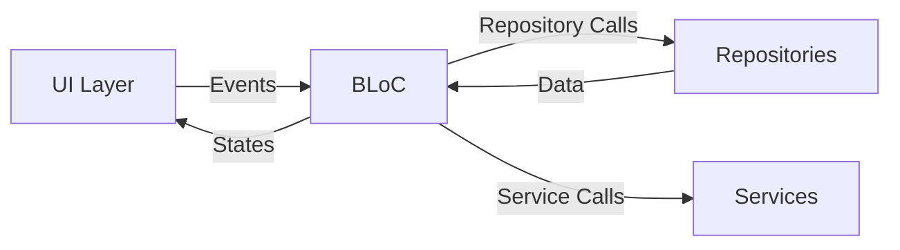

# BLoC Pattern in TaskTamer

TaskTamer uses the BLoC (Business Logic Component) pattern via the `flutter_bloc` package to manage application state. This document provides an overview of the BLoC implementation in the application.

## BLoC Architecture Overview

The BLoC pattern separates business logic from UI components, providing a clean, reactive approach to state management with a unidirectional data flow:

1. **Events**: Triggered by user interactions or application lifecycle events
2. **BLoC**: Processes events and updates state accordingly
3. **States**: Represents the application state at a given point in time
4. **UI**: Reacts to state changes through the BlocBuilder/BlocListener widgets

## BLoC Diagram



## BLoC Architecture

Each feature in TaskTamer has its own BLoC with three primary components:

### 1. Events

Events represent actions or information from the UI layer. They're usually triggered by user interactions.

```dart
abstract class TaskEvent extends Equatable {
  const TaskEvent();

  @override
  List<Object?> get props => [];
}

class LoadTasks extends TaskEvent {
  const LoadTasks();
}

class AddTask extends TaskEvent {
  final String title;
  final String? description;
  // Other properties...

  const AddTask({
    required this.title,
    this.description,
    // Other parameters...
  });

  @override
  List<Object?> get props => [/* properties list */];
}

// Other events...
```

### 2. States

States represent the condition of the application at a specific point in time and are used to update the UI.

```dart
abstract class TaskState extends Equatable {
  const TaskState();

  @override
  List<Object?> get props => [];
}

class TaskInitial extends TaskState {
  const TaskInitial();
}

class TaskLoading extends TaskState {
  const TaskLoading();
}

class TasksLoaded extends TaskState {
  final List<Task> tasks;

  const TasksLoaded(this.tasks);

  @override
  List<Object> get props => [tasks];
}

// Other states...
```

### 3. BLoC

The BLoC class processes incoming events, performs business logic, and emits new states.

```dart
class TaskBloc extends Bloc<TaskEvent, TaskState> {
  final TaskRepository _taskRepository;
  final UserRepository _userRepository;
  final NotificationService _notificationService;

  TaskBloc({
    required TaskRepository taskRepository,
    required UserRepository userRepository,
    required NotificationService notificationService,
  }) : _taskRepository = taskRepository,
       _userRepository = userRepository,
       _notificationService = notificationService,
       super(const TaskInitial()) {
    on<LoadTasks>(_onLoadTasks);
    on<AddTask>(_onAddTask);
    // Register other event handlers...
  }

  Future<void> _onLoadTasks(LoadTasks event, Emitter<TaskState> emit) async {
    emit(const TaskLoading());
    try {
      final tasks = await _taskRepository.getAllTasks();
      emit(TasksLoaded(tasks));
    } catch (e) {
      emit(TaskOperationFailure(e.toString()));
    }
  }

  // Other event handlers...
}
```

## Core BLoCs

### TaskBloc

The `TaskBloc` manages task-related operations:

- **Events**: `LoadTasks`, `AddTask`, `UpdateTask`, `DeleteTask`, `CompleteTask`, `ResetTaskCompletion`, `CheckTasksForReset`
- **States**: `TaskInitial`, `TaskLoading`, `TasksLoaded`, `TaskOperationSuccess`, `TaskOperationFailure`
- **Dependencies**: `TaskRepository`, `UserRepository`, `NotificationService`

### CreatureBloc

The `CreatureBloc` manages creature-related operations:

- **Events**: `LoadCreatures`, `InitializeDefaultCreatures`, `AddCreature`, `UpdateCreature`, `DeleteCreature`, `UnlockCreature`, `AddExperiencePoints`, `RenameCreature`
- **States**: `CreatureInitial`, `CreatureLoading`, `CreaturesLoaded`, `CreatureOperationSuccess`, `CreatureOperationFailure`
- **Dependencies**: `CreatureRepository`

### UserBloc

The `UserBloc` manages user profile-related operations:

- **Events**: `LoadUserProfile`, `UpdateUserProfile`, `AddExperiencePoints`, `UpdateUserName`, `UpdateUserAvatar`
- **States**: `UserInitial`, `UserLoading`, `UserProfileLoaded`, `UserOperationSuccess`, `UserOperationFailure`
- **Dependencies**: `UserRepository`

## BLoC Integration

BLoCs are registered in the service locator:

```dart
// Register BLoCs
serviceLocator.registerFactory<TaskBloc>(
  () => TaskBloc(
    taskRepository: serviceLocator<TaskRepository>(),
    userRepository: serviceLocator<UserRepository>(),
    notificationService: serviceLocator<NotificationService>(),
  ),
);
```

And provided to the application through BlocProvider:

```dart
return MultiBlocProvider(
  providers: [
    BlocProvider<TaskBloc>(
      create: (context) => serviceLocator<TaskBloc>()..add(const LoadTasks()),
    ),
    BlocProvider<UserBloc>(
      create: (context) => serviceLocator<UserBloc>()..add(const LoadUserProfile()),
    ),
    BlocProvider<CreatureBloc>(
      create: (context) => serviceLocator<CreatureBloc>()
        ..add(const InitializeDefaultCreatures())
        ..add(const LoadCreatures()),
    ),
  ],
  child: MaterialApp(...),
);
```

## UI Integration

UI components listen for state changes and render accordingly:

```dart
BlocBuilder<TaskBloc, TaskState>(
  builder: (context, state) {
    if (state is TaskLoading) {
      return const CircularProgressIndicator();
    } else if (state is TasksLoaded) {
      return TasksList(tasks: state.tasks);
    } else if (state is TaskOperationFailure) {
      return Text('Error: ${state.error}');
    } else {
      return const SizedBox.shrink();
    }
  },
)
```

Events are dispatched to the BLoC when user interactions occur:

```dart
ElevatedButton(
  onPressed: () {
    context.read<TaskBloc>().add(
      AddTask(
        title: 'New Task',
        description: 'Task description',
      ),
    );
  },
  child: const Text('Add Task'),
)
```
