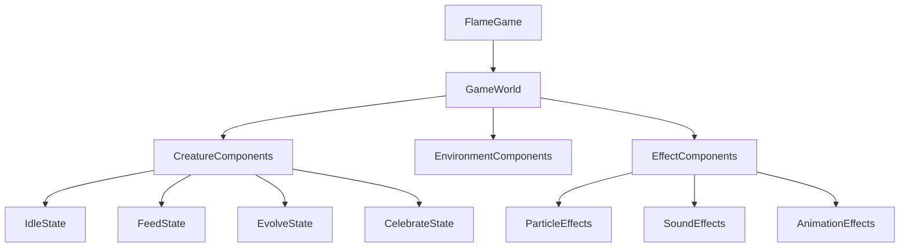

# TaskTamer Game Engine Overview

TaskTamer uses the Flame engine, a game development framework for Flutter, to create engaging and interactive creature animations and gameplay elements.

## Game Architecture

The game components in TaskTamer follow a component-based architecture:



## Core Components

### GameWorld

The `GameWorld` acts as a container for all game elements, managing:

- Camera and viewport
- Component addition and removal
- Collision detection
- Update and render loops

### CreatureComponent

The `CreatureComponent` represents the visual elements of a creature:

```dart
class CreatureComponent extends PositionComponent with HasGameRef<FlameGame> {
  final Creature creature;
  late SpriteAnimation idleAnimation;
  late SpriteAnimation feedAnimation;
  late SpriteAnimation evolveAnimation;

  CreatureState _currentState = CreatureState.idle;

  CreatureComponent({required this.creature}) {
    // Load animations
    // Set up behaviors
  }

  @override
  Future<void> onLoad() async {
    // Load sprite sheets and animations
  }

  @override
  void update(double dt) {
    // Update animation state
    super.update(dt);
  }

  void feed() {
    // Play feed animation
    // Add particle effects
  }

  void evolve() {
    // Play evolve animation
    // Add transformation effects
  }

  void celebrate() {
    // Play celebration animation
    // Add particle effects
  }
}
```

### EffectComponents

Various effect components enhance the visual experience:

- **ParticleEffects**: Visual particles for actions like task completion
- **SoundEffects**: Sound feedback for interactions
- **AnimationEffects**: Temporary animations for special events

## Game States

The creature game elements have multiple states:

- **Idle**: The default state when no interaction is happening
- **Feed**: When the creature is being fed after task completion
- **Evolve**: When the creature evolves to a higher level
- **Celebrate**: When a milestone is achieved

## Asset Management

Game assets are managed through a central asset loader:

```dart
class GameAssets {
  static Future<void> loadAll() async {
    // Preload all sprite sheets and sounds
  }

  static SpriteAnimation getCreatureAnimation(String species, String state) {
    // Return the appropriate animation for the creature and state
  }

  static Future<void> playSoundEffect(String sound) async {
    // Play a sound effect
  }
}
```

## Integration with UI

The game components are integrated with the Flutter UI through a `GameWidget`:

```dart
class CreatureView extends StatelessWidget {
  final Creature creature;

  const CreatureView({super.key, required this.creature});

  @override
  Widget build(BuildContext context) {
    return SizedBox(
      width: 200,
      height: 200,
      child: GameWidget(
        game: FlameGame()
          ..add(CreatureComponent(creature: creature)),
      ),
    );
  }
}
```

## Game Loop and Performance

The Flame engine provides an optimized game loop for smooth animations:

1. **Update**: Calculates new positions, states, and behaviors
2. **Render**: Draws components to the screen

Performance optimizations include:

- Sprite sheet batching to reduce draw calls
- Component pooling for reusable elements
- Viewport culling to only render visible elements

## Interaction with BLoC

Game components interact with the application's BLoC system:

1. **State Changes**: When the BLoC state changes, game components update accordingly
2. **Events**: Game interactions can trigger BLoC events
3. **Rewards**: Task completion in the BLoC can trigger game rewards and animations

For example, when a task is completed:

```dart
BlocListener<TaskBloc, TaskState>(
  listenWhen: (previous, current) =>
      current is TaskOperationSuccess &&
      (current as TaskOperationSuccess).message.contains('completed'),
  listener: (context, state) {
    if (state is TaskOperationSuccess) {
      // Trigger creature feeding animation
      creatureComponent.feed();

      // Play sound effect
      GameAssets.playSoundEffect('task_complete');
    }
  },
  child: CreatureView(creature: creature),
)
```

## Future Game Features

Planned game features include:

- **Creature Interactions**: Allowing creatures to interact with each other
- **Mini-games**: Task-related challenges for extra rewards
- **Environments**: Different habitats for creatures
- **Weather Effects**: Dynamic environmental effects
- **Day/Night Cycle**: Time-based visual changes
