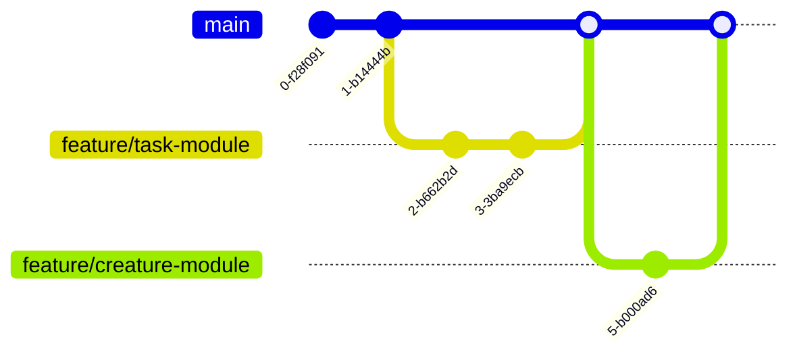
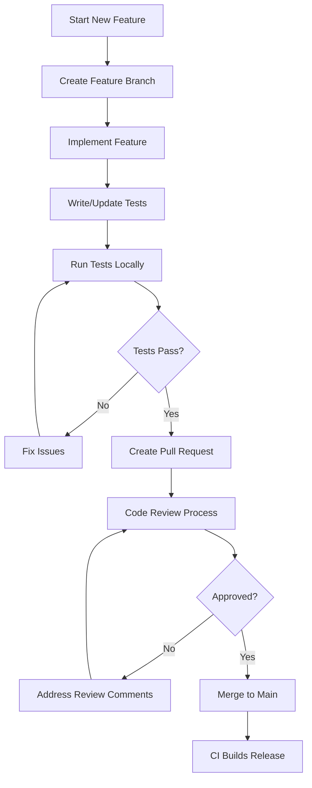
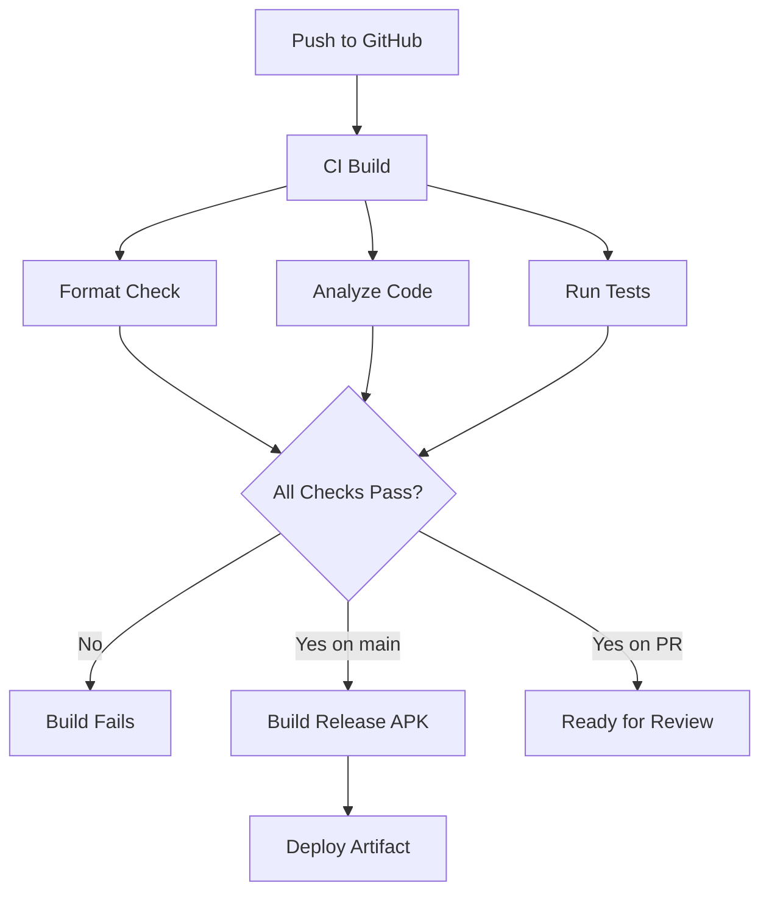
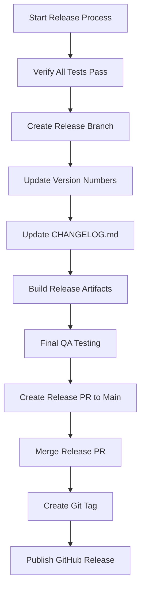

# TaskTamer Development Workflow

This guide outlines the development workflow for the TaskTamer application, including setup, development process, and deployment.

## Development Environment Setup

### Prerequisites

- Flutter SDK (3.8.0+)
- Dart SDK (3.8.0+)
- For Linux: GTK development libraries
- For Chrome: A recent Chrome browser
- Git

### Setting Up the Development Environment

1. **Clone the repository**:

```bash
git clone https://github.com/yourusername/TaskTamer.git
cd TaskTamer
```

2. **Install dependencies**:

```bash
flutter pub get
```

3. **Run the setup script**:

```bash
dart tool/setup.dart
```

This script will:

- Configure git hooks
- Verify Flutter SDK installation
- Ensure all dependencies are installed
- Set up optional developer tools

## Development Workflow

### Branch Strategy



The project follows a feature branch workflow:

1. **main**: Production-ready code
2. **feature/[feature-name]**: New features or enhancements
3. **bugfix/[bug-name]**: Bug fixes
4. **hotfix/[issue-name]**: Critical fixes for production

### Development Cycle



#### Step-by-Step Process

1. **Create a new branch**:

```bash
git checkout -b feature/task-form
```

2. **Make changes and commit regularly**:

```bash
git add .
git commit -m "Add task form validation"
```

3. **Run tests locally**:

```bash
flutter test
```

4. **Push the branch**:

```bash
git push origin feature/task-form
```

5. **Create a pull request**:
   - Go to GitHub and create a pull request
   - Fill in the PR template with details about the changes
   - Request reviews from team members

6. **Address review comments** and update the PR

7. **Merge the PR** once approved

## Code Quality Standards

### Code Formatting

The project uses `dart format` with a line length of 100 characters:

```bash
dart format --line-length=100 .
```

This is automatically run by the pre-commit hook.

### Static Analysis

The project uses `dart analyze` with a high level of strictness:

```bash
dart analyze --fatal-infos
```

This is automatically run by the pre-commit hook.

### Testing Requirements

- All new features should include appropriate tests
- Maintain or improve code coverage

### Documentation Requirements

- Document public APIs with dartdoc comments
- Update README and other documentation when necessary
- Include screenshots or GIFs for UI changes

## Git Hooks

The project uses git hooks to ensure code quality:

### Pre-Commit Hook

The pre-commit hook will:

1. Format code using `dart format`
2. Run static analysis using `dart analyze`
3. Run tests for modified files

### Pre-Push Hook

The pre-push hook will:

1. Run all tests
2. Verify that all tests pass
3. Check code formatting

## CI/CD Pipeline



The project uses GitHub Actions for continuous integration and delivery:

- **On Pull Requests**: Code is formatted, analyzed, and tested
- **On Main Branch**: The app is built and an APK is generated

## Release Process



### Version Naming Convention

TaskTamer follows semantic versioning (MAJOR.MINOR.PATCH):

- **MAJOR**: Incompatible API changes
- **MINOR**: New features in a backward-compatible manner
- **PATCH**: Backward-compatible bug fixes

### Release Steps

1. **Create a release branch**:

```bash
git checkout -b release/vX.Y.Z
```

2. **Update version numbers** in `pubspec.yaml`

3. **Update CHANGELOG.md** with release notes

4. **Create a pull request** for the release

5. **Merge to main** after approval

6. **Tag the release**:

```bash
git tag vX.Y.Z
git push origin vX.Y.Z
```

7. **Create a GitHub release** with the tag and release notes

## Troubleshooting

### Common Issues

- **Flutter build fails**: Run `flutter clean` and try again
- **Platform-specific issues**: Check the platform folder (android, ios, etc.)
- **Dependency conflicts**: Update `pubspec.yaml` and run `flutter pub get`

### Debug Mode

Use Visual Studio Code's debugging features to debug the application:

1. Open the project in VS Code
2. Press F5 or select "Run and Debug" from the sidebar
3. Choose the appropriate launch configuration

### Performance Profiling

Use Flutter DevTools for performance profiling:

```bash
flutter run --profile
```

Then connect to DevTools using the URL provided in the console.
