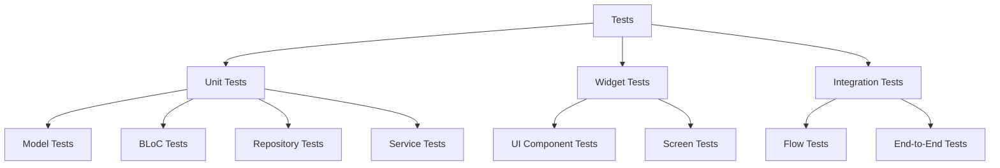

# TaskTamer Testing Guide

This document provides comprehensive information on the testing setup and practices for the TaskTamer application.

## Testing Structure

The tests are organized into different categories:



## Directory Structure

```
test/
├── blocs/                 # BLoC unit tests
│   ├── task_bloc_test.dart
│   ├── creature_bloc_test.dart
│   └── user_bloc_test.dart
├── models/                # Model unit tests
│   ├── task_test.dart
│   ├── creature_test.dart
│   └── user_profile_test.dart
├── repositories/          # Repository unit tests
│   ├── task_repository_test.dart
│   ├── creature_repository_test.dart
│   └── user_repository_test.dart
├── services/              # Service unit tests
│   └── notification_service_test.dart
├── widgets/               # Widget tests
│   ├── task_list_item_test.dart
│   ├── task_form_test.dart
│   └── creature_card_test.dart
├── run_all_tests.dart     # Script to run all unit tests
└── widget_test.dart       # Main app widget test

integration_test/
└── app_test.dart          # End-to-end integration tests
```

## Test Categories

### Unit Tests

Unit tests focus on testing individual components in isolation:

#### Model Tests

Testing model classes ensures that data structures behave correctly:

```dart
void main() {
  group('Task Model', () {
    test('should create a Task instance with required fields', () {
      final task = Task(
        id: '1',
        title: 'Test Task',
        creationDate: DateTime.now(),
      );

      expect(task.id, '1');
      expect(task.title, 'Test Task');
      expect(task.isCompleted, false);
    });

    test('should copy a Task with updated fields', () {
      final task = Task(
        id: '1',
        title: 'Test Task',
        creationDate: DateTime.now(),
      );

      final updatedTask = task.copyWith(title: 'Updated Task');

      expect(updatedTask.id, task.id);
      expect(updatedTask.title, 'Updated Task');
      expect(updatedTask.creationDate, task.creationDate);
    });

    // More tests...
  });
}
```

#### BLoC Tests

BLoC tests verify that business logic behaves correctly:

```dart
void main() {
  late TaskBloc taskBloc;
  late MockTaskRepository mockTaskRepository;
  late MockUserRepository mockUserRepository;
  late MockNotificationService mockNotificationService;

  setUp(() {
    mockTaskRepository = MockTaskRepository();
    mockUserRepository = MockUserRepository();
    mockNotificationService = MockNotificationService();
    taskBloc = TaskBloc(
      taskRepository: mockTaskRepository,
      userRepository: mockUserRepository,
      notificationService: mockNotificationService,
    );
  });

  tearDown(() {
    taskBloc.close();
  });

  group('TaskBloc', () {
    test('initial state should be TaskInitial', () {
      expect(taskBloc.state, const TaskInitial());
    });

    blocTest<TaskBloc, TaskState>(
      'emits [TaskLoading, TasksLoaded] when LoadTasks is added',
      build: () {
        when(() => mockTaskRepository.getAllTasks())
            .thenAnswer((_) async => []);
        return taskBloc;
      },
      act: (bloc) => bloc.add(const LoadTasks()),
      expect: () => [
        const TaskLoading(),
        const TasksLoaded([]),
      ],
    );

    // More tests...
  });
}
```

### Widget Tests

Widget tests verify that UI components render correctly and respond to interactions:

```dart
void main() {
  group('TaskListItem', () {
    testWidgets('should render task title', (WidgetTester tester) async {
      final task = Task(
        id: '1',
        title: 'Test Task',
        creationDate: DateTime.now(),
      );

      await tester.pumpWidget(
        MaterialApp(
          home: Scaffold(
            body: TaskListItem(task: task),
          ),
        ),
      );

      expect(find.text('Test Task'), findsOneWidget);
    });

    testWidgets('should call onComplete when checkbox is tapped',
        (WidgetTester tester) async {
      final task = Task(
        id: '1',
        title: 'Test Task',
        creationDate: DateTime.now(),
      );

      bool onCompleteCalled = false;

      await tester.pumpWidget(
        MaterialApp(
          home: Scaffold(
            body: TaskListItem(
              task: task,
              onComplete: () {
                onCompleteCalled = true;
              },
            ),
          ),
        ),
      );

      await tester.tap(find.byType(Checkbox));
      await tester.pump();

      expect(onCompleteCalled, true);
    });

    // More tests...
  });
}
```

### Integration Tests

Integration tests verify that multiple components work together correctly:

```dart
void main() {
  IntegrationTestWidgetsFlutterBinding.ensureInitialized();

  group('End-to-end tests', () {
    testWidgets('Create and complete a task', (WidgetTester tester) async {
      await tester.pumpWidget(const TaskTamerApp());
      await tester.pumpAndSettle();

      // Navigate to Tasks screen
      await tester.tap(find.byIcon(Icons.task_alt));
      await tester.pumpAndSettle();

      // Tap add task button
      await tester.tap(find.byType(FloatingActionButton));
      await tester.pumpAndSettle();

      // Fill in task form
      await tester.enterText(find.byType(TextField).first, 'Integration Test Task');
      await tester.tap(find.text('Save'));
      await tester.pumpAndSettle();

      // Verify task is created
      expect(find.text('Integration Test Task'), findsOneWidget);

      // Complete the task
      await tester.tap(find.byType(Checkbox).last);
      await tester.pumpAndSettle();

      // Verify task is completed (strikethrough or other indicator)
      // expect(...);

      // Navigate to Dashboard
      await tester.tap(find.byIcon(Icons.dashboard));
      await tester.pumpAndSettle();

      // Verify creature received XP
      // expect(...);
    });
  });
}
```

## Running Tests

### Unit Tests

To run all unit tests:

```bash
flutter test
```

To run a specific test file:

```bash
flutter test test/models/task_test.dart
```

### Integration Tests

To run integration tests:

```bash
flutter test integration_test/app_test.dart
```

## Test Coverage

To generate test coverage report:

```bash
flutter test --coverage
```

Then, to view coverage report in HTML format:

```bash
genhtml coverage/lcov.info -o coverage/html
```

Open `coverage/html/index.html` in a web browser to view the coverage report.

## Mocking

TaskTamer uses `mocktail` for creating mocks in tests:

```dart
class MockTaskRepository extends Mock implements TaskRepository {}
class MockUserRepository extends Mock implements UserRepository {}
class MockNotificationService extends Mock implements NotificationService {}
```

## Continuous Integration

Tests are automatically run as part of the CI/CD pipeline in GitHub Actions:

```yaml
- name: Run tests
  run: flutter test --coverage

- name: Upload coverage reports to Codecov
  uses: codecov/codecov-action@v3
  with:
    token: ${{ secrets.CODECOV_TOKEN }}
    file: ./coverage/lcov.info
```

## Test-Driven Development

When adding new features to TaskTamer, it's recommended to follow test-driven development (TDD):

1. Write a failing test that defines the expected behavior
2. Implement the minimum code to make the test pass
3. Refactor the code while ensuring the test still passes

## Testing Best Practices

1. **Test Isolation**: Each test should be independent and not rely on other tests
2. **Meaningful Assertions**: Test only what matters for the specific case
3. **Test Edge Cases**: Test boundary conditions and error cases
4. **Mock External Dependencies**: Use mocks for repositories and services
5. **Keep Tests Readable**: Use descriptive test names and clear assertions
6. **Test Actual Behavior**: Focus on testing behavior, not implementation details
7. **Maintain Tests**: Update tests when the code changes
