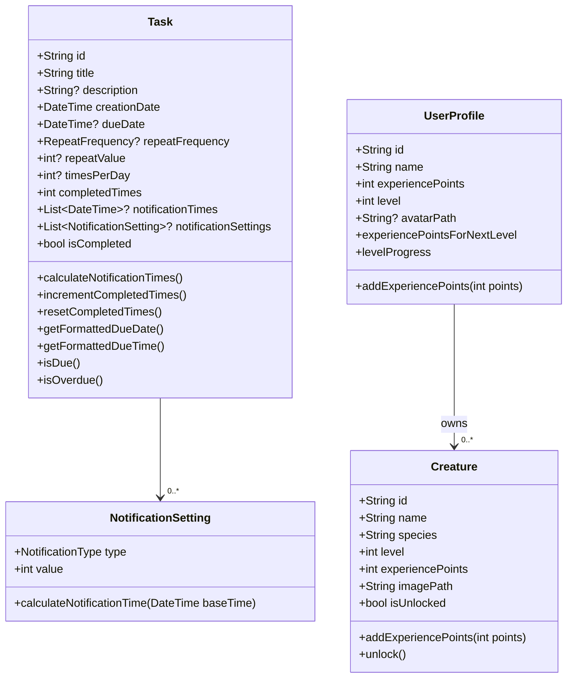

# TaskTamer Data Models

This document provides an overview of the data models used in the TaskTamer application.

## Model Diagram

## Core Models

### Task

The `Task` model represents a task that the user needs to complete. Tasks can be one-time or recurring, and can have notifications.

**Key Properties:**

- `id`: Unique identifier for the task
- `title`: The task title
- `description`: Optional detailed description
- `creationDate`: When the task was created
- `dueDate`: When the task is due (optional)
- `repeatFrequency`: How often the task repeats (hourly, daily, weekly, monthly, yearly)
- `repeatValue`: Value for repeat frequency (e.g., every 2 days)
- `timesPerDay`: How many times the task should be completed per day
- `completedTimes`: How many times the task has been completed
- `notificationSettings`: Settings for when to notify the user
- `isCompleted`: Whether the task is completed

**Key Methods:**

- `calculateNotificationTimes()`: Calculates notification times based on settings
- `incrementCompletedTimes()`: Increments the completion count
- `resetCompletedTimes()`: Resets the completion count
- `isDue()`: Checks if the task is due
- `isOverdue()`: Checks if the task is overdue

### Creature

The `Creature` model represents a virtual pet that the user can collect and level up by completing tasks.

**Key Properties:**

- `id`: Unique identifier for the creature
- `name`: The creature's name
- `species`: The creature's species
- `level`: The creature's current level
- `experiencePoints`: The creature's current experience points
- `imagePath`: Path to the creature's image
- `isUnlocked`: Whether the creature is unlocked

**Key Methods:**

- `addExperiencePoints(int points)`: Adds experience points and updates level
- `unlock()`: Unlocks the creature

### UserProfile

The `UserProfile` model represents the user's profile information.

**Key Properties:**

- `id`: Unique identifier for the user
- `name`: The user's name
- `experiencePoints`: The user's current experience points
- `level`: The user's current level
- `avatarPath`: Path to the user's avatar image

**Key Methods:**

- `addExperiencePoints(int points)`: Adds experience points and updates level
- `experiencePointsForNextLevel`: Calculates points needed for the next level
- `levelProgress`: Calculates progress towards the next level

### NotificationSetting

The `NotificationSetting` model represents a setting for when to notify the user about a task.

**Key Properties:**

- `type`: The type of notification (minutes, hours, days before due)
- `value`: The value for the notification type

**Key Methods:**

- `calculateNotificationTime(DateTime baseTime)`: Calculates the notification time

## Immutability and Equality

All models in TaskTamer are immutable and implement `Equatable` for proper equality comparison. This ensures that models are compared by value rather than reference, which is important for state management with BLoC.

## JSON Serialization

All models implement `toJson()` and `fromJson()` methods for serialization and deserialization. This allows them to be easily stored in and retrieved from local storage using Hive.
