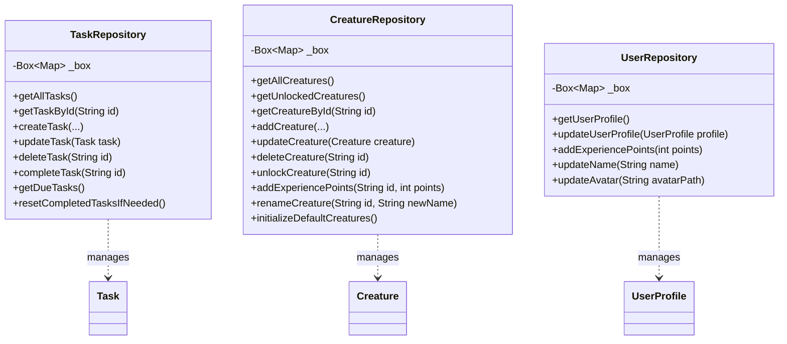

# TaskTamer Repositories

This document provides an overview of the repository classes used in the TaskTamer application for data persistence.

## Repository Pattern

TaskTamer uses the Repository pattern to abstract data storage operations. Each repository is responsible for:

1. **Data Access**: Providing methods to create, read, update, and delete data
2. **Data Conversion**: Converting between domain models and storage formats
3. **Storage Logic**: Handling storage-specific operations

All repositories use Hive for local storage, which provides a key-value database that works across all platforms.

## Repository Diagram



## Core Repositories

### TaskRepository

The `TaskRepository` manages task data persistence, including creating, updating, completing, and deleting tasks.

**Key Methods:**

- `getAllTasks()`: Retrieves all tasks
- `getTaskById(String id)`: Retrieves a specific task by ID
- `createTask(...)`: Creates a new task
- `updateTask(Task task)`: Updates an existing task
- `deleteTask(String id)`: Deletes a task
- `completeTask(String id)`: Marks a task as completed
- `getDueTasks()`: Retrieves tasks that are due
- `resetCompletedTasksIfNeeded()`: Resets completed recurring tasks when their repeat period has elapsed

### CreatureRepository

The `CreatureRepository` manages creature data persistence, including creating, updating, and unlocking creatures.

**Key Methods:**

- `getAllCreatures()`: Retrieves all creatures
- `getUnlockedCreatures()`: Retrieves only unlocked creatures
- `getCreatureById(String id)`: Retrieves a specific creature by ID
- `addCreature(...)`: Adds a new creature
- `updateCreature(Creature creature)`: Updates an existing creature
- `deleteCreature(String id)`: Deletes a creature
- `unlockCreature(String id)`: Unlocks a creature
- `addExperiencePoints(String id, int points)`: Adds experience points to a creature
- `renameCreature(String id, String newName)`: Renames a creature
- `initializeDefaultCreatures()`: Initializes the repository with default creatures if empty

### UserRepository

The `UserRepository` manages user profile data persistence.

**Key Methods:**

- `getUserProfile()`: Retrieves the user profile
- `updateUserProfile(UserProfile profile)`: Updates the user profile
- `addExperiencePoints(int points)`: Adds experience points to the user
- `updateName(String name)`: Updates the user's name
- `updateAvatar(String avatarPath)`: Updates the user's avatar

## Initialization

Each repository has a static `create()` method that initializes the Hive box and returns a new repository instance:

```dart
static Future<TaskRepository> create() async {
  final box = await Hive.openBox<Map<dynamic, dynamic>>(_boxName);
  return TaskRepository(box);
}
```

These repositories are registered as singletons in the service locator:

```dart
final taskRepository = await TaskRepository.create();
serviceLocator.registerSingleton<TaskRepository>(taskRepository);
```
