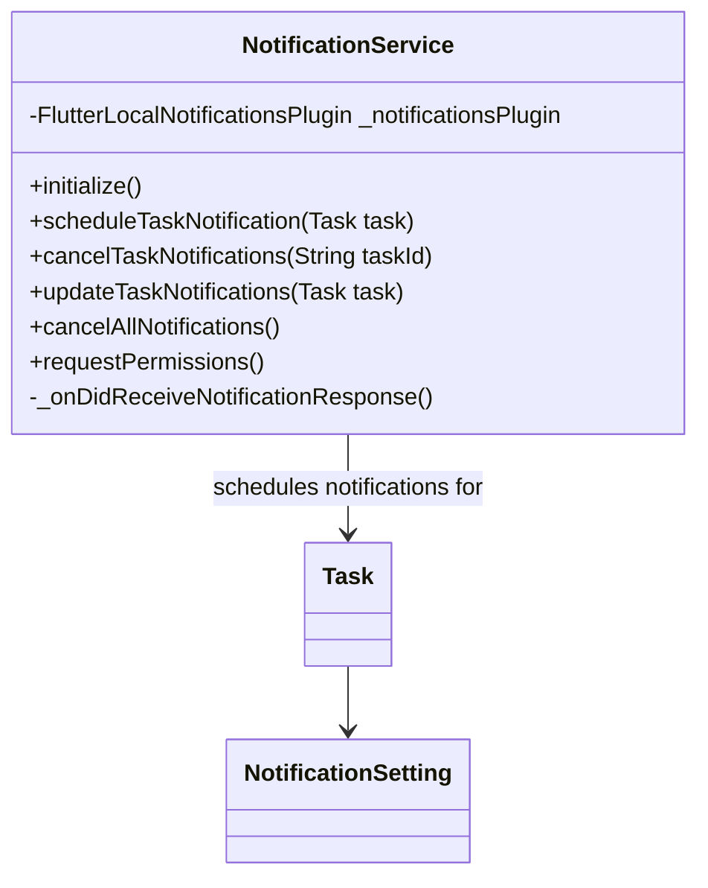

# Notification Service

The `NotificationService` in TaskTamer is responsible for scheduling, managing, and displaying local notifications for task reminders. This document provides an overview of the notification system.

## Service Overview

The `NotificationService` uses the `flutter_local_notifications` package to manage platform-specific notifications. It provides:

1. Platform agnostic notification scheduling
2. Task-specific notification management
3. Timezone-aware scheduling
4. Notification permission handling

## Service Diagram



## Key Features

### Initialization

The service initializes the notification plugin with platform-specific settings:

```dart
Future<void> initialize() async {
  tz_data.initializeTimeZones();

  const AndroidInitializationSettings initializationSettingsAndroid =
      AndroidInitializationSettings('@mipmap/ic_launcher');

  final DarwinInitializationSettings initializationSettingsIOS = DarwinInitializationSettings(
    requestAlertPermission: true,
    requestBadgePermission: true,
    requestSoundPermission: true,
  );

  final InitializationSettings initializationSettings = InitializationSettings(
    android: initializationSettingsAndroid,
    iOS: initializationSettingsIOS,
  );

  await _notificationsPlugin.initialize(
    initializationSettings,
    onDidReceiveNotificationResponse: _onDidReceiveNotificationResponse,
  );
}
```

### Scheduling Notifications

The service schedules notifications based on task due dates and notification settings:

```dart
Future<void> scheduleTaskNotification(Task task) async {
  // Skip if no due date
  if (task.dueDate == null) {
    return;
  }

  // Get notification times
  List<DateTime>? timesToSchedule = task.notificationTimes;

  // Calculate times from settings if available
  if (task.notificationSettings != null && task.notificationSettings!.isNotEmpty) {
    final calculatedTimes = task.calculateNotificationTimes();
    if (calculatedTimes != null && calculatedTimes.isNotEmpty) {
      // Use calculated times or append to existing times
      timesToSchedule = timesToSchedule ?? [] + calculatedTimes;
    }
  }

  // Schedule each notification
  for (int i = 0; i < timesToSchedule.length; i++) {
    // Schedule using flutter_local_notifications
  }
}
```

### Managing Notifications

The service provides methods to manage task notifications:

- `cancelTaskNotifications(String taskId)`: Cancels all notifications for a specific task
- `updateTaskNotifications(Task task)`: Updates notifications when a task is modified
- `cancelAllNotifications()`: Cancels all scheduled notifications

### Permission Handling

The service can request notification permissions on Android:

```dart
Future<bool> requestPermissions() async {
  final permissionStatus = await _notificationsPlugin
      .resolvePlatformSpecificImplementation<AndroidFlutterLocalNotificationsPlugin>()
      ?.requestNotificationsPermission();

  return permissionStatus ?? false;
}
```

## Notification ID Management

To manage multiple notifications for a single task (e.g., for multiple notification settings), the service creates unique notification IDs by:

1. Using the task's ID hash code as a base
2. Appending an index for each notification time
3. Truncating to a valid integer for the notification system

## Usage in the Application

The `NotificationService` is registered as a singleton in the service locator and injected into the `TaskBloc`, which calls the appropriate methods:

- When a task is created: `scheduleTaskNotification`
- When a task is updated: `updateTaskNotifications`
- When a task is deleted: `cancelTaskNotifications`
