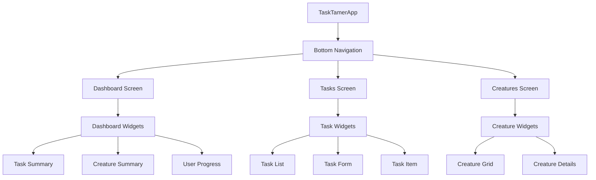

# TaskTamer UI Overview

This document provides an overview of the UI (User Interface) structure and design in the TaskTamer application.

## UI Architecture

TaskTamer follows a hierarchical UI structure with screens, widgets, and themes:



## Screen Structure

The application uses a bottom navigation bar for primary navigation between three main screens:

1. **Dashboard**: Provides a quick overview of tasks and creatures
2. **Tasks**: Displays a list of tasks with actions to create, update, and complete tasks
3. **Creatures**: Shows a grid of creatures with details and progress

## Key UI Components

### HomeScreen

The `HomeScreen` is the main container that manages navigation between screens:

```dart
class HomeScreen extends StatefulWidget {
  const HomeScreen({super.key});

  @override
  State<HomeScreen> createState() => _HomeScreenState();
}

class _HomeScreenState extends State<HomeScreen> {
  int _currentIndex = 0;

  final List<Widget> _screens = [
    const DashboardScreen(),
    const TasksScreen(),
    const CreaturesScreen(),
  ];

  // ...
}
```

### TasksScreen

The `TasksScreen` displays a list of tasks with filtering options:

```dart
class TasksScreen extends StatelessWidget {
  const TasksScreen({super.key});

  @override
  Widget build(BuildContext context) {
    return BlocBuilder<TaskBloc, TaskState>(
      builder: (context, state) {
        if (state is TaskLoading) {
          return const Center(child: CircularProgressIndicator());
        } else if (state is TasksLoaded) {
          final tasks = state.tasks;
          return TaskList(tasks: tasks);
        } else {
          return const Center(child: Text('No tasks available'));
        }
      },
    );
  }
}
```

### CreaturesScreen

The `CreaturesScreen` displays a grid of creatures with progress:

```dart
class CreaturesScreen extends StatelessWidget {
  const CreaturesScreen({super.key});

  @override
  Widget build(BuildContext context) {
    return BlocBuilder<CreatureBloc, CreatureState>(
      builder: (context, state) {
        if (state is CreatureLoading) {
          return const Center(child: CircularProgressIndicator());
        } else if (state is CreaturesLoaded) {
          final creatures = state.creatures;
          return CreatureGrid(creatures: creatures);
        } else {
          return const Center(child: Text('No creatures available'));
        }
      },
    );
  }
}
```

## Theme System

TaskTamer uses a theme system to provide consistent styling throughout the app, with both light and dark themes:

```dart
class AppTheme {
  static const Color _primaryColor = Color(0xFF6200EA);
  static const Color _secondaryColor = Color(0xFF03DAC6);

  // Light theme
  static final ThemeData lightTheme = ThemeData(
    useMaterial3: true,
    colorScheme: const ColorScheme.light(
      primary: _primaryColor,
      secondary: _secondaryColor,
      // Other colors...
    ),
    // Component themes...
  );

  // Dark theme
  static final ThemeData darkTheme = ThemeData(
    useMaterial3: true,
    colorScheme: const ColorScheme.dark(
      primary: _darkPrimaryColor,
      secondary: _secondaryColor,
      // Other colors...
    ),
    // Component themes...
  );
}
```

The theme is applied to the application in the `TaskTamerApp` widget:

```dart
class TaskTamerApp extends StatelessWidget {
  const TaskTamerApp({super.key});

  @override
  Widget build(BuildContext context) {
    return MultiBlocProvider(
      providers: [/* BLoC providers */],
      child: MaterialApp(
        title: 'TaskTamer',
        theme: AppTheme.lightTheme,
        darkTheme: AppTheme.darkTheme,
        themeMode: ThemeMode.system,
        debugShowCheckedModeBanner: false,
        home: const HomeScreen(),
      ),
    );
  }
}
```

## Responsive Design

The UI is designed to adapt to different screen sizes using:

1. **Flexible layouts**: Using `Expanded`, `Flexible`, and `SingleChildScrollView`
2. **Adaptive widgets**: Adjusting based on available space
3. **Appropriate padding and margins**: Ensuring consistent spacing

## User Interactions

TaskTamer provides several interaction patterns:

- **Lists and grids**: For displaying collections of tasks and creatures
- **Forms**: For creating and updating tasks
- **Dialogs**: For confirmation and quick actions
- **Bottom sheets**: For task creation and details
- **Tap and long-press actions**: For quick interactions with tasks and creatures

## Accessibility Considerations

The UI is designed with accessibility in mind:

- **Semantic labels**: For screen readers
- **Sufficient contrast**: For readability
- **Scalable text**: For users with visual impairments
- **Touch targets**: Large enough for easy interaction
